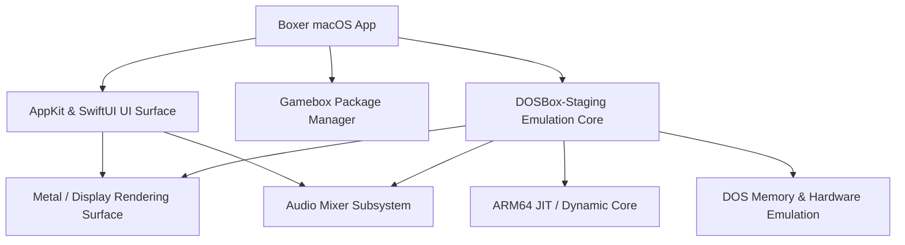

# System architecture

## Layers & Modules
- **UI & Presentation**: AppKit and SwiftUI hybrid frontend with modern macOS design.
- **Emulation Engine**: Embedded DOSBox-Staging core configured for Apple Silicon.
- **Media Pipelines**: Low-latency audio mixer and Metal-accelerated video scaling.
- **Gamebox Bundle**: Self-contained DOS game container management.
