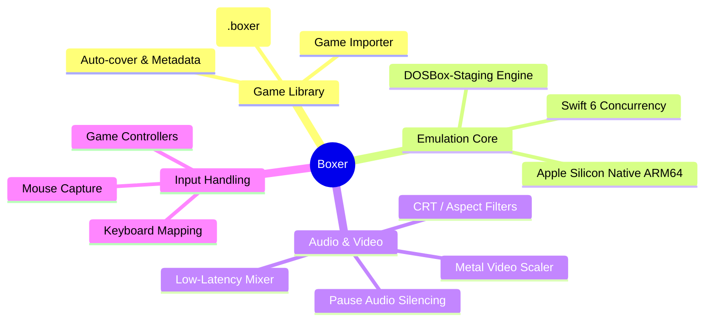

# Feature mindmap

```mermaid
mindmap
  root((Boxer))
    Game Library
      Boxer Bundles (.boxer)
      Game Importer
      Auto-cover & Metadata
    Emulation Core
      DOSBox-Staging Engine
      Apple Silicon Native ARM64
      Swift 6 Concurrency
    Audio & Video
      Metal Video Scaler
      CRT / Aspect Filters
      Low-Latency Mixer
      Pause Audio Silencing
    Input Handling
      Game Controllers
      Mouse Capture
      Keyboard Mapping
```
